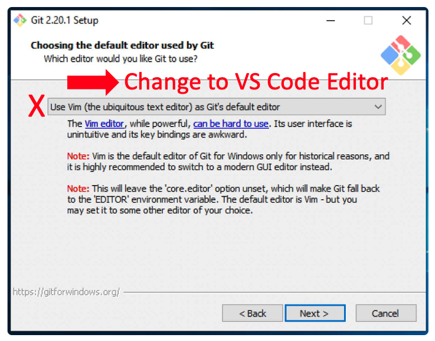

# Task 2: Getting started with Github

All of the homework assignments for this class will be submitted using GitHub, a freely available code repository. GitHub allows programmers to share and collaboratively write code together. It also allows users to track changes they make in their code and revert back to older versions if needed. As part of this class you will share your code with me (your instructor Bonnie Hurwitz) so that I can grade your assignments. If you get stuck you can also "push" your code to Github and I can point out errors or mistakes for you to fix.

Also, all of the course materials are available to you in a GitHub repository. Below, you will learn how to make a copy of this repository and use it for writing code and turning in homework assignments.

## Creating a GitHub account

The following will help you create a GitHub account and copy the course repository into your own account.
This will allow you to have your own copy of the assignments, a place to write programs, and a repository in Github that you can submit your assignments to.  

First, create your free [GitHub](http://github.com) account 

* Go to [GitHub](http://github.com)
* Create a (free) user account

## Copy the course repository to your own GitHub account

Next, go to the [course repository](https://github.com/bhurwitz33/be434-spring-2023) and click the "Fork" button so as to make a copy of the code into your own Github account.

* Go to [the course repo](https://github.com/bhurwitz33/be434-spring-2023)
* Click the "Fork" button (upper-right)
* Indicate that you will use it for personal reasons


This will create a new repository in your Github account. 

## Share your "copy" of the course repository with the instructor

All your assignments will be pushed to GitHub where I will pull the code to my machine for checking and grading. Add my GitHub username "bhurwitz33" as a Collaborator on your repo so that I can push and pull code, and then email me your GitHub username and the URL for your repo (bhurwitz@arizona.edu). At the end of the semester, you will have a public repository of code you can share to show proficiency in Python coding and testing. 

* Go to the "Settings" for your repo called "be434-spring-2023"
* Choose "Manage Access" from the left panel
* Click the green "Invite a collaborator" button
* Add "bhurwitz33" and send


## Install Git, a program for managing source code, to update your GitHub repository locally on your laptop

In order to use Git locally on your laptop, you need to install [Git](https://git-scm.com/), a program for managing source code (see instructions below for macOS and PC users). In the next setup doc (setup3), I will show you how to use Git from VS Code, a code editor, to write Python directly on your laptop, and then submit these changes back to GitHub (a web-based code repository).

### Mac Users Git Installation

* Install homebrew if you don't already have it, run the following command from a terminal window (Applications -> Utils -> Terminal).

```
/bin/bash -c "$(curl -fsSL https://raw.githubusercontent.com/Homebrew/install/HEAD/install.sh)"
```

* Install Git

```
brew install git
```

### PC Users Git Installation

* Download the .exe Git installation program from [Git](https://git-scm.com/) for your computer
* Follow all defaults except for the following two. These are important settings, otherwise you will end up with an error saying that your Python tests fail due to "\r" return characters at the end of every line in your code. No fun!





## Authors

Bonnie Hurwitz <bhurwitz@arizona.edu> and Ken Youens-Clark <kyclark@gmail.com>