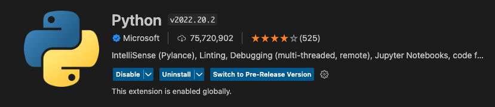
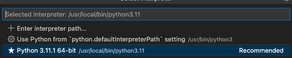

# Task 3: Installing WSL/Ubuntu, Python and VS Code on your PC Computer

In this class, we will be teaching you Python programming from the ground up! The best way to learn Python is by practicing as often as you can. By installing python directly on your laptop, you can practice anywhere and anytime you like, with or without an internet connection.

I have added detailed instructions below, but here are a few resources for extra details on how this works on your PC:
* [Developing in WSL in VSCode](https://code.visualstudio.com/docs/remote/wsl)
* [Remote Development in WSL](https://www.youtube.com/watch?v=bz1KauFlbQI)

## Getting Started, Installing WSL and Ubuntu on your PC

Before we can get started, we need to install a basic Unix Operating System on your Windows machine. Windows Subsystem for Linux (WSL) comes with the Windows operating system, but you must enable it and install a Linux distribution (Ubuntu) before you can begin using it. This will allow you to use basic Unix commands in this class including "chmod" for making your python scripts executable, and "make test" to run the tests on your python code to make sure the code is correct.

### Enable WSL on your PC

Windows Subsystem for Linux (WSL) is an optional feature on Windows 10. You can enable it through PowerShell or the Windows Features dialog.

You can install it using PowerShell with the following command (note you will need to restart afterwards):

```
Enable-WindowsOptionalFeature -Online -FeatureName Microsoft-Windows-Subsystem-Linux
```

Or, you can enbale it in the Windows Features dialog:


### Install the Ubuntu app on your PC

Next you need to install a Linux distribution for WSL from the Microsoft Store. We will use Ubuntu. You can use the store app, or search for a Linux distro in the Windows search bar. Choose the Linux distribution you want to install (Ubuntu) and follow the prompts.


And when done, select Launch to get started. This will open a Linux terminal and complete the installation. You'll need to create a user ID and password since you are setting up a full Linux instance. You are now running Linux on Windows. When it opens, we will create a user / password for Ubuntu.


## Installing Python on your Ubuntu distribution

Now that you have Ubuntu installed on your PC, you need to install the version of Python that we will be using for the class (Python 3.11.1). Note that Python version 3.10 comes with the Ubuntu installation (and this one is fine to use too). But, to get the latest and fastest Python (Python 3.11.1) and pip (for installing Python modules), copy/paste the following commands into the Ubuntu terminal (use your Ubuntu user/password from above when prompted)

```
sudo add-apt-repository ppa:deadsnakes/ppa
sudo apt update
sudo apt install python3.11
python3 --version
sudo update-alternatives --install /usr/bin/python3 python3 /usr/bin/python3.10 1
sudo update-alternatives --install /usr/bin/python3 python3 /usr/bin/python3.11 2
sudo update-alternatives --config python3
sudo apt install python3.11-venv
sudo apt install python3-pip
```

You can check to see the the newest version of Python and pip are installed using the following commands:

```
python3 --version
pip3 --version
```

You will also need to update your $PATH to tell your computer where to find Python.

```
touch ~/.profile
nano ~/.profile
```

Add the line below to the ~/.profile file when the nano file editor opens it (I usually add this in the first empty line you see, but it can be anywhere in the file). Once do this you can ^W (command W) to write the file, and ^X (command X) to exit the file.

```
export PATH="~/.local/bin:$PATH"
```

You now have Python installed, and your computer knows where to find it!

## Getting started with the VS Code Editor

Code editors (or Integrated Development Environment, IDEs) are fantastic resources that make it easy to write and edit code on your laptop. There are many code editors out there, but in this class, we will be using the VS Code editor to write and edit our Python programs. Code editors recognize the programming language we are coding in and highlight the syntax of the code making it easier to "see" mistakes or typos. In addition, code editors offer code completion options and can even suggest a Python functions for you to use based on a few letters. Amazing! IDEs will definitely make your life easier! I recommend learning as much as you can about VS Code to find out its capabilities and how it can help you in writing great code. For now, here are a few instructions to get you started.

Visual Studio Code is a lightweight but powerful source code editor which runs on your desktop. We will write and edit Python code using the Visual Studio code editor. Follow the directions on the VS Code website to download and install the version of [VS Code](https://code.visualstudio.com/) that is appropriate for your PC laptop.

## Installing the Python and WSL extensions for VS Code

Once VS Code is installed you will also need to install an extension for Python. VS Code can be used for programming in many different programming languages, so we will need to tell VSCode that we want to use Python. You can learn more about extensions [here](https://code.visualstudio.com/docs/introvideos/extend). 

To install the extension, go the the VS Code menu, Select View -> Extensions, to pull up the "Extensions Market Place" on the left-hand panel. Search for and install "Python" by IntelliSense. This extension works alongside Python in Visual Studio Code to provide performant language support, linters, and debuggers for Python. You will learn about each of these in the days to come. They will be useful in formatting your code to make it beautiful, while also checking for mistakes and errors.



Next, you will need to install an extension for WSL in VS Code. Search for and install "WSL" by Microsoft. This allows you to use the WSL/Ubuntu Linux OS you just installed in VS Code.


To try out the WSL extension, open a terminal window in VS Code, and type 'wsl' in the terminal window.


If you have any trouble with WSL not starting, try the following

* Press F1 (to open the command palette), select "WSL: New WSL Window using Distro", and select the "Ubuntu default distro"

## Telling VS Code which version of Python to use

We need to tell VS code which version of Python to use, and point to the latest version that we just installed (Python 3.11.1). To do this, you can go to menu bar and select View -> Command Palette. Then in the search box type "Python: Select Interpreter". Choose the most recent version of python that you just installed 3.11.1. Now you are all set to start writing Python code in VS Code!



## Cloning a copy of your Class GitHub repository (be434-spring-2023) onto your laptop and using in VS Code

You should have already created a copy of the class GitHub repository under your own web-based GitHub account. If not, go back to setup2_github to create a GitHub account and make a copy of the class GitHub repository. 

In this section, we will be cloning (or copying) your repository from your web-based GitHub repository to your laptop. Here is a [great video](https://www.youtube.com/watch?v=bz1KauFlbQI) that walks you through the steps for cloning a GitHib repository into VS Code. The overall steps are:

* From the Source Control view in VS Code (third icon down on the left side panel) click on the button to Clone Repository. Alternatively, you can use the "Git: Clone" command in the Command Palette.


* Once you click on "Clone Repository", you'll see the option to Clone from GitHub. 


* Authenticate with your GitHub account and authorize VS Code to search through repositories by name


* Select your be434-spring-2023 repository to clone it to your computer. It should open in VS code once you do this.


We will be using Git inside of VScode to commit and push your code to GitHub. Check out this [video](https://youtu.be/i_23KUAEtUM) to learn more about how to do this.

And, check out a cheatsheet [here](https://training.github.com/downloads/github-git-cheat-sheet.pdf) on Git.

You can also use the [GitHub Desktop application](https://desktop.github.com/) to commit code, if you find it easier than using Git from VS Code.

## Installing Python modules for running tests on your code

Now that you have downloaded the class repository, you can install all of the Python modules we will use in the class to test you code (found in the be434-spring-2023/docs/requirements.txt file). Python modules (or code packages) are written by people in Python community and can be used by anyone to perform certain functions in Python. We are going to use several Python modules in this class to test your code and make sure it meets community standards. Open a terminal in VS Code (Terminal -> New Terminal) which should take you to the be434-spring-2023 folder (that you opened when you cloned the repository above), then navigate to the docs folder like so:

```
cd ./docs
python3 -m pip install -r ./docs/requirements.txt
```

To make sure you installed the modules correctly, try a few out. You should get help messages from each program telling you how to run them.

```
flake8 --help
pylint --help
```

Overview of the commands:

```
black # this command will format our code properly
pytest # this command will test our code with default test discovery mechanism.
mypy # this command will run type checks on our code with mypy.
flake8 # this command will check code linting.
```

## Fixing a small issue with pylint

Now you have installed all of the python modules that we need for testing your code! Congrats! When we start testing our code (in the weeks to come), you might find that "pylint" complains about the variable `rv` (return value) that is in the _test.py_ file of each homework. This is a perfectly fine variable name, so to silence this warning, create your own configuration file like so:

```
pylint --generate-rcfile > ~/.pylintrc
```

Then edit that file using nano to add the following line after "MAIN".

```
nano ~/.pylintrc
```

add this line to ~/.pylintrc. Note that this should be one continuous line.

```
disable=too-many-locals,invalid-name,too-many-statements,too-many-arguments,cell-var-from-loop,wrong-import-order
``` 

Use ctr-W & return to save the file, and ctr-X to exit

## Author

Bonnie Hurwitz <bhurwitz@arizona.edu>