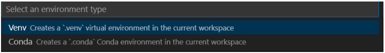
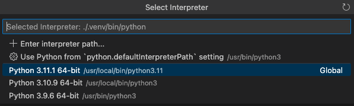
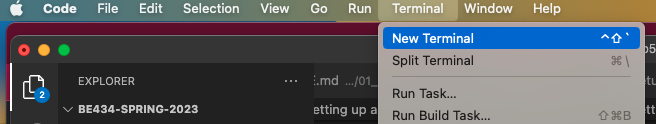
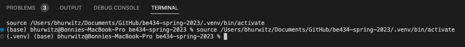

# Task 3: Installing Python, VS Code, and a virtual env on your macOS Computer

In this class, we will be teaching you Python programming from the ground up! The best way to learn Python is by practicing as often as you can. By installing python directly on your laptop, you can practice anywhere and anytime you like, with or without an internet connection.

## Downloading and building Python from source (the quick overview)

Python is already be installed natively on your laptop (if you are a mac user) or can be installed using many applications (e.g. Anaconda, a package for data science and Bioinformatics). These applications may have different versions of Python, and the macOS ships with an older version of python. To simplify installation and make troubleshooting in the class easy, we will all be using the same version of Python and installing it from source on your laptop.

We will be using Python Version 3.11.1. Let's install it. We can download the installable package from the [official website](https://www.python.org/downloads/release/python-3111/). The website should automatically offer us a link to install Python 3 for macOS. Click on the executable installer and follow the steps to install it on your machine (which includes the license and entering your system password). Great, now we have a new and improved version of Python on our macOS. You can check the version by pulling up a terminal window (under the Utils folder in Applications) and running:

```
python3 --version
```

Quick note that you can install Python through package managers like Homebrew or anaconda, but for consistency we are installing right from the source!

## Getting started with the VS Code Editor

Code editors (or Integrated Development Environment, IDEs) are fantastic resources that make it easy to write and edit code on your laptop. There are many code editors out there, but in this class, we will be using the VS Code editor to write and edit our Python programs. Code editors recognize the programming language we are coding in and highlight the syntax of the code making it easier to "see". In addition, code editors offer code completion options and can even suggest a Pytnon function for you to use based on a few letters. Amazing! IDEs will definitely make your life easier! I recommend learning as much as you can about VS Code to find out its capabilities and how it can help you in writing great code. For now, here are a few instructions to get you started.

Visual Studio Code is a lightweight but powerful source code editor which runs on your desktop. We will write and edit python code using the Visual Studio code editor. Follow the directions on the VS Code website to download and install the version of [VS Code](https://code.visualstudio.com/) that is appropriate for your macOS laptop.

## Installing the Python extensions for VS Code

Once VS Code is installed you will also need to install an extension for Python. VS Code can be used for programming in many different programming languages, so we will need to tell VSCode that we want to use Python. You can learn more about extensions [here](https://code.visualstudio.com/docs/introvideos/extend). To install the extension, go the the VS Code menu, Select View -> Extensions, to pull up the "Extensions Market Place" on the left-hand panel. Search for and install "Python" by IntelliSense. This extension works alongside Python in Visual Studio Code to provide performant language support, linters, and debuggers for Python. You will learn about each of these in the days to come. They will be useful in formatting your code to make it beautiful, while also checking for mistakes and errors.

## Telling VScode which version of Python to use

We need to tell VScode which version of Python to use, and point to the latest version that we just installed. To do this, you can go to View -> Command Palette. Then in the search box type "Python: Select Interpreter". Choose the most recent version of python that you just installed 3.11.1. Now you are all set to start writing Python code in VS Code!

## Setting up a virtual environment in VS code for our class

When you installed Python on your computer you installed it globally on your computer. But, working in a global environment can be tricky because different versions of python packages may not play nicely together. To avoid any conflicts, developers usually create a virtual environment for each project and then install the packages they need in that virtual environment. When you then run a Python program within that environment, you know that it's running against only those specific packages.

We are going to create a virtual environment in VS Code for our class. We will install several python packages/modules that will help us to test, debug and format our code in this virtual environment.

* From the VS Code menu bar select File -> Open Folder -> Then navigate to the be433-spring-2023 folder in GitHub (mine is in Documents/GitHub)

### Step 1: Create a virtual environment in the BE434-spring-2023 workspace (directory)

Next, we will create a virtual environment (venv) in VS Code to install all of the Python packages we will need for our class. venv allows you to manage separate package installations for different projects and is installed with Python 3 by default.

* From within VS Code, you can create non-global environments, using virtual environments by opening the Command Palette (⇧⌘P), start typing "Python: Create Environment command" to search, and then select the command.

The command presents a list of environment types: Venv or Conda. Select Venv.


The the command presents a list of interpreters that can be used as a base Python for the new virtual environment. Select Python Version 3.11.1 that we just installed.


### Step 2: Install the Python modules we need for this class

Once you have created your vitual environment, you can install Python modules in that environment. In Python, modules are how you obtain any number of useful code libraries. For example, in this class we will use several modules that will help us to test, debug and format code. These are all contained in the requirement.txt file in the docs directory in the be434-spring-2023 Github repository.  

First we need to open a terminal window in VS Code:


Note, you should already have the be434-spring-2023 directory open in VS Code and it should automatically activate the virtual environment when you open the terminal


If this is not the case, be sure to open the be434-spring-2023 directory in VS Code and then activate the virtual machine

You will need to enter the following commands in the terminal:
```
source .venv/bin/activate
```

Now you can install the python modules we need into your virtual environment. You can do this with a single command (from the be343-spring-2023 folder):

```
python3 -m pip install -r ./docs/requirements.txt
```

Or by installing each one individually...

```
python3 -m pip install pytest
python3 -m pip install pylint
python3 -m pip install flake8
python3 -m pip install yapf
python3 -m pip install black
python3 -m pip install mypy
python3 -m pip install pytest-flake8
python3 -m pip install pytest-mypy
python3 -m pip install pytest-pylint
```

Overview of the commands:

```
black # this command will format our code properly
pytest # this command will test our code with default test discovery mechanism.
mypy # this command will run type checks on our code with mypy.
flake8 # this command will check code linting.
```

## Fixing a small issue with pylint

Now you have installed all of the python modules that we need for testing your code! Congrats! When we start testing our code (in the weeks to come), you might find that "pylint" complains about the variable `rv` (return value) that is in the _test.py_ file of each homework. This is a perfectly fine variable name, so to silence this warning, create your own configuration file like so:

```
pylint --generate-rcfile > ~/.pylintrc
```

Then edit that file to add the following line after "MAIN". Note that this should be one continuous line, but I've broken it here for display:

```
disable=too-many-locals,invalid-name,too-many-statements,too-many-arguments,cell-var-from-loop,wrong-import-order
``` 

```
nano ~/.pylintrc
```

Use ctr-O & return to save the file, and ctr-X to exit

## Author

Bonnie Hurwitz <bhurwitz@arizona.edu>