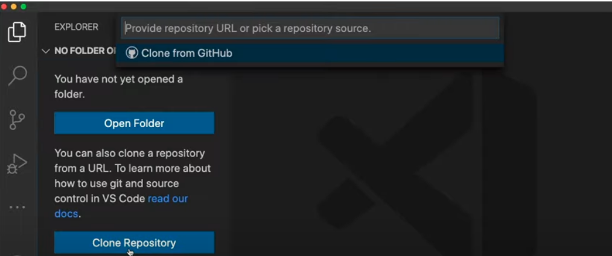

# Task 3: Installing Python and VS Code on your macOS Computer

In this class, we will be teaching you Python programming from the ground up! The best way to learn Python is by practicing as often as you can. By installing Python directly on your laptop, you can practice anywhere and anytime you like, with or without an internet connection.

## Downloading and building Python from source

Python is already installed natively on your laptop but the macOS comes with an older version (Python 2). You may have also installed another version of Python using applications like Anaconda, a package for data science and Bioinformatics. To simplify installation and make troubleshooting in the class easy, we will all be using the same version of Python and installing it from source on your laptop.

We will be using Python Version 3.11.1. Let's install it. We can download the installable package from the [official website](https://www.python.org/downloads/release/python-3111/). The website should automatically offer you a link to install Python 3 for macOS. Click on the executable installer and follow the steps to install it on your machine (this includes accepting the license and entering your system password). Great, now we have a new and improved version of Python on our macOS. 

Now, let's tell your mac which version of Python to use, we do this by updating your $PATH. The version of Python that you just installed went into the /usr/local/bin directory by default. And by default macOS users are in the zsh Unix Shell. This means we need to update your ~/.zshrc file with the following aliases to tell your operating system where to find the newest versions of Python and pip.

First, pull up a terminal window (under the Utils folder in Applications). Then follow the instructions below. Edit the .zshrc file and add the lines below, anywhere in the file, then save.

```
nano ~/.zshrc
```

Add these lines:
```
alias python=/usr/local/bin/python3.11
alias python3=/usr/local/bin/python3.11
alias pip=/usr/local/bin/pip3.11
alias pip3=/usr/local/bin/pip3.11
```

Once you do this, you need to refresh your .zshrc to have the changes take effect:

```
source ~/.zshrc
```

You can check to see you are using the newest version of Python by running:

```
python3 --version
pip3 --version
```

You should see
```
Python 3.11.1
pip 23.0 from /Users/your-user-name/Library/Python/3.11/lib/python/site-packages/pip (python 3.11)
```

## Getting started with the VS Code Editor

Code editors (or Integrated Development Environment, IDEs) are fantastic resources that make it easy to write and edit code on your laptop. There are many code editors out there, but in this class, we will be using the VS Code editor to write and edit our Python programs. Code editors recognize the programming language we are coding in and highlight the syntax of the code making it easier to "see" mistakes or typos. In addition, code editors offer code completion options and can even suggest a Python functions for you to use based on a few letters. Amazing! IDEs will definitely make your life easier! I recommend learning as much as you can about VS Code to find out its capabilities and how it can help you in writing great code. For now, here are a few instructions to get you started.

Visual Studio Code is a lightweight but powerful source code editor which runs on your desktop. We will write and edit Python code using the Visual Studio code editor. Follow the directions on the VS Code website to download and install the version of [VS Code](https://code.visualstudio.com/) that is appropriate for your macOS laptop.

## Installing the Python extensions for VS Code

Once VS Code is installed you will also need to install an extension for Python. VS Code can be used for programming in many different programming languages, so we will need to tell VSCode that we want to use Python. You can learn more about extensions [here](https://code.visualstudio.com/docs/introvideos/extend). To install the extension, go the the VS Code menu, Select View -> Extensions, to pull up the "Extensions Market Place" on the left-hand panel. Search for and install "Python" by IntelliSense. This extension works alongside Python in Visual Studio Code to provide performant language support, linters, and debuggers for Python. You will learn about each of these in the days to come. They will be useful in formatting your code to make it beautiful, while also checking for mistakes and errors.


## Telling VScode which version of Python to use

We need to tell VScode which version of Python to use, and point to the latest version that we just installed (Python 3.11.1). To do this, you can go to menu bar and select View -> Command Palette. Then in the search box type "Python: Select Interpreter". Choose the most recent version of python that you just installed 3.11.1. Now you are all set to start writing Python code in VS Code!


## Cloning a copy of your Class GitHub repository (be434-spring-2023) onto your laptop and using in VS Code

You should have already created a copy of the class GitHub repository under your own web-based GitHub account. If not, go back to setup2_github to create a GitHub account and make a copy of the class GitHub repository. 

In this section, we will be cloning (or copying) your repository from your web-based GitHub repository to your laptop. Here is a [great video](https://www.youtube.com/watch?v=bz1KauFlbQI) that walks you through the steps for cloning a GitHib repository into VS Code. The overall steps are:

* From the Source Control view in VS Code (third icon down on the left side panel) click on the button to Clone Repository. Alternatively, you can use the "Git: Clone" command in the Command Palette.


* Once you click on "Clone Repository", you'll see the option to Clone from GitHub. 



* Authenticate with your GitHub account and authorize VS Code to search through repositories by name


* Select your be434-spring-2023 repository to clone it to your computer. It should open in VS code once you do this.


We will be using Git inside of VScode to commit and push your code to GitHub. Check out this [video](https://youtu.be/i_23KUAEtUM) to learn more about how to do this.

And, check out a cheatsheet [here](https://training.github.com/downloads/github-git-cheat-sheet.pdf) on Git.

You can also use the [GitHub Desktop application](https://desktop.github.com/) to commit code, if you find it easier than using Git from VS Code.

## Installing Python modules for running tests on your code

Now that you have downloaded the class repository, you can install all of the Python modules we will use in the class to test you code (found in the be434-spring-2023/docs/requirements.txt file). Python modules (or code packages) are written by people in Python community and can be used by anyone to perform certain functions in Python. We are going to use several Python modules in this class to test your code and make sure it meets community standards. Open a terminal in VS Code (Terminal -> New Terminal) which should take you to the be434-spring-2023 folder, then navigate to the docs folder like so:

```
cd ./docs
python3 -m pip install -r ./docs/requirements.txt
```

To make sure you installed the modules correctly, try a few out. You should get help messages from each program telling you how to run them.

```
flake8 --help
pylint --help
```

Overview of the commands:

```
black # this command will format our code properly
pytest # this command will test our code with default test discovery mechanism.
mypy # this command will run type checks on our code with mypy.
flake8 # this command will check code linting.
```

## Fixing a small issue with pylint

Now you have installed all of the python modules that we need for testing your code! Congrats! When we start testing our code (in the weeks to come), you might find that "pylint" complains about the variable `rv` (return value) that is in the _test.py_ file of each homework. This is a perfectly fine variable name, so to silence this warning, create your own configuration file like so:

```
pylint --generate-rcfile > ~/.pylintrc
```

Then edit that file using nano to add the following line after "MAIN".

```
nano ~/.pylintrc
```

add this line to ~/.pylintrc. Note that this should be one continuous line.

```
disable=too-many-locals,invalid-name,too-many-statements,too-many-arguments,cell-var-from-loop,wrong-import-order
``` 

Use ctr-O & return to save the file, and ctr-X to exit

## Author

Bonnie Hurwitz <bhurwitz@arizona.edu>